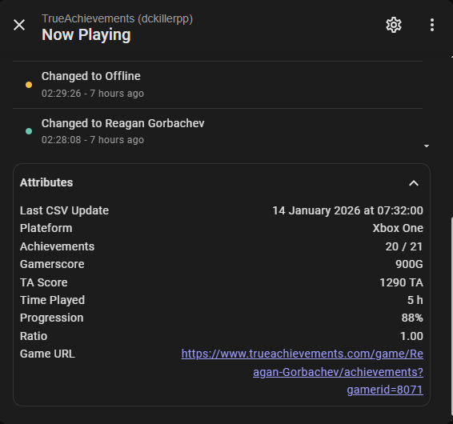

# TrueAchievements for Home Assistant

> [!IMPORTANT] > **This integration requires a TrueAchievements PRO account.** > Data is retrieved via the "CSV Export" feature, which is a premium feature exclusive to Pro members on the TrueAchievements website.

## Overview

Bring your Xbox accomplishments into Home Assistant! This integration synchronizes your **TrueAchievements** statistics (Gamerscore, TA Score, Completion) and provides a dynamic "Now Playing" sensor that reflects your current game progress in real-time.

## How it Works

The integration utilizes the TrueAchievements CSV export feature to fetch your data. It periodically scans your collection and, when linked with a Home Assistant Xbox sensor, triggers an immediate refresh whenever you switch games.

**Key Features:**

- **Global Stats:** Track your total Gamerscore, TrueAchievement Score, and overall completion percentage.
- **Dynamic "Now Playing":** See the current game's title, platform, achievement progress, and TA ratio.
- **Privacy Focused:** All CSV processing is done locally on your Home Assistant instance.
- **Multi-language:** Full support for English and French.

## Prerequisites

1. **TrueAchievements PRO Account:** You must have an active **Pro** subscription. This is required to access the `download.aspx?type=gamecollection` export used by this integration.
2. **GamerID & Token:** You will need your numeric GamerID and your full session cookie string.
3. **Xbox Integration (Optional but Recommended):** To enable instant "Now Playing" updates, you should have the official Home Assistant Xbox integration installed.

## Installation

### Via HACS (Recommended)

1. Open **HACS** in Home Assistant.
2. Search for **"TrueAchievements"** using the top search bar.
3. Click on the **TrueAchievements** integration that appears.
4. Click **Download** in the bottom right corner.
5. **Restart** Home Assistant.

### Manual Installation

1. Download the latest release.
2. Copy the `custom_components/trueachievements` folder into your `config/custom_components` directory.
3. Restart Home Assistant.

## Configuration

1. Go to **Settings** -> **Devices & Services**.
2. Click **Add Integration** and search for **TrueAchievements**.
3. **Setup fields:**
   - **Gamertag:** Your Xbox name.
   - **GamerID:** Your unique numeric ID from TrueAchievements.
   - **GamerToken:** Your full session cookie value (see below).
   - **Now Playing Entity:** Select your Xbox `sensor.xbox_now_playing`.
   - **Excluded Apps:** (Optional) List apps like "YouTube" or "Netflix" to ignore them in stats.

## Sensors Created

| Sensor                 | Description                             | Key Attributes / Info                   |
| :--------------------- | :-------------------------------------- | :-------------------------------------- |
| **Gamerscore**         | Your total Gamerscore (G).              | Total GS accumulated.                   |
| **TA Score**           | Your total TrueAchievement score.       | Total TA points.                        |
| **Completion %**       | Global achievement completion rate.     | Percentage based on total achievements. |
| **Total Games**        | Total number of games started.          | Excludes apps (if configured).          |
| **Completed Games**    | Games finished with 100% achievements.  | Games with all achievements unlocked.   |
| **Total Achievements** | Total individual achievements unlocked. | All games combined.                     |
| **Now Playing**        | Current game name and details.          | **See detailed attributes below.**      |
| **Auth Status**        | Binary sensor for session validity.     | `ON` if token needs update.             |

---

### 🎮 Now Playing Attributes

When a game is detected via your linked Xbox entity, the **Now Playing** sensor (`sensor.trueachievements_now_playing`) provides these detailed attributes for use in your dashboards:

| Attribute         | Example / Description                                            |
| :---------------- | :--------------------------------------------------------------- |
| `name`            | Full title of the game.                                          |
| `platform`        | Xbox Series X\|S, PC, Nintendo Switch, etc.                      |
| `achievements`    | Progression format (e.g., `10 / 42`).                            |
| `gamerscore`      | Points earned vs Total (e.g., `140 G / 1000 G`).                 |
| `ta_score`        | Specific TA points earned vs Total (e.g., `165 TA / 1778 TA`).   |
| `hours_played`    | Estimated time spent on the title.                               |
| `game_completion` | Percentage completed for this specific title.                    |
| `game_ratio`      | The difficulty ratio of the game (e.g., `1.45`).                 |
| `game_url`        | Direct link to the game's page on TrueAchievements.              |
| `walkthrough_url` | Link to the TA Guide (or "Not available for this title").        |
| `last_update`     | Timestamp of the last successful CSV sync from TrueAchievements. |

> [!TIP]
> You can use the `walkthrough_url` attribute in a **Tap Action** on your dashboard to open the guide directly when you're stuck on a achievement!

## Screenshots

|                   Global Stats                    |                 Now Playing Detail                 |
| :-----------------------------------------------: | :------------------------------------------------: |
|  |  |

## FAQ

### ⚠️ Why do I need a TrueAchievements Pro account?

TrueAchievements limits the automated export of game data (CSV export) to their **Pro members**. Since this integration relies on that specific feature to fetch your stats without scraping the website (which is against their TOS), a Pro subscription is mandatory.

### Where can I find my GamerID?

Your **GamerID** is the number found in the URL when you visit your own profile on TrueAchievements:
`https://www.trueachievements.com/gamer/YourName?gamerid=123456`
In this example, the ID is `123456`.

### Where can I find my GamerToken? (Reliable Method)

To ensure a successful connection, you should copy the full cookie string from your browser headers:

1. Log in to [TrueAchievements](https://www.trueachievements.com) in your desktop browser.
2. Open the **Developer Tools** (`F12` or `Right-click > Inspect`).
3. Go to the **Network** tab.
4. Refresh the page (`F5`).
5. Click on the first request (usually named after your Gamertag or the main page).
6. In the right-hand panel, locate the **Request Headers** section.
7. Find the line labeled **cookie:**.
8. Copy the **entire value** (a long string usually starting with `ASP.NET_SessionId=...`).
9. Paste this full string into the **GamerToken** field in Home Assistant.

### Why is my current game showing "Offline" or missing details?

This usually happens when the name provided by the Xbox integration doesn't perfectly match the name in the TrueAchievements database (e.g., "Roblox - Xbox" vs "ROBLOX").

1. **Check your notifications:** Home Assistant will alert you if a mismatch is detected.
2. **Report the mismatch:** Open a request on our [Game Mapping Issue](https://github.com/dckiller51/trueachievements/issues/2).
3. **Include details:** Provide the exact name shown in Home Assistant and the one on TrueAchievements.

We regularly update the internal dictionary to fix these naming inconsistencies.

## Privacy & Security

**Warning:** Your `GamerToken` is a sensitive piece of information that allows access to your TrueAchievements session.

- This integration **never** sends your token to any third-party server.
- The token is only used to communicate directly with `www.trueachievements.com` to download your CSV file.
- It is stored securely within the Home Assistant internal configuration.

## Credits

This integration is not affiliated with Microsoft or TrueAchievements. All game data and images are property of their respective owners.
